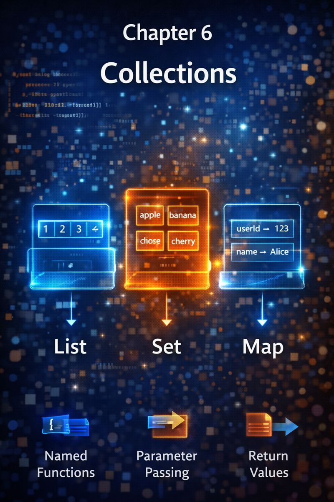

# Chapter 6: Collections



## 1. Concept Goal  
**What problem does this solve?**  
Real apps don’t work with single values—they manage lists of users, sets of tags, or maps of settings.  
Collections let you **store, access, and manipulate groups of data** safely and efficiently.

---

## 2. Logical Explanation  
Dart gives you three core collection types—each for a specific purpose:

- **`List`**: An **ordered** sequence (like a shopping list). Items can repeat. Access by index (`list[0]`).  
- **`Set`**: An **unordered** collection of **unique** items (like tags). Fast existence checks.  
- **`Map`**: A collection of **key-value pairs** (like a dictionary). Look up values by key (`map['name']`).

Choose the right structure:
- Need order or duplicates? → `List`  
- Need uniqueness or fast “is this present?”? → `Set`  
- Need to associate labels with data? → `Map`

Mutability matters:  
- Use **`final`** for collections you’ll modify (add/remove items)  
- Use **`const`** only if contents never change

---

## 3. Visual Representation  

**List (Ordered, Index-Based)**  
```
Index:   0        1        2
       [ "Ali" , "Sara" , "Ali" ]
```

**Set (Unique, Unordered)**  
```
{ "dart", "flutter", "null-safety" }
// "dart" added twice? → stored once.
```

**Map (Key → Value)**  
```
{
  "name"    : "Ali",
  "age"     : 28,
  "active"  : true
}
```

> Each structure matches a real-world data relationship.

---

## 4. Dart Syntax  

```dart
// List
final List<String> names = ['Ali', 'Sara'];
names.add('Omar'); // OK – list is mutable

// Set
final Set<String> tags = {'dart', 'flutter'};
tags.add('dart'); // ignored – already exists

// Map
final Map<String, dynamic> user = {
  'name': 'Ali',
  'age': 28,
};
user['isLoggedIn'] = true; // add new key

// Common iteration
for (final name in names) { ... }
for (final tag in tags) { ... }
for (final entry in user.entries) {
  print('${entry.key}: ${entry.value}');
}
```

> All three support `final` + mutation. Only use `const` if truly immutable.

---

## 5. Practical Examples  

### Example 1: User Permissions (Set)  
```dart
final Set<String> permissions = {'read', 'write'};
if (permissions.contains('delete')) {
  showDeleteButton();
}
```
> Fast check. No duplicates by design.

### Example 2: Product Catalog (List)  
```dart
final List<Product> products = fetchProducts();
final featured = products.where((p) => p.isFeatured).toList();
```
> Order matters. Filtering preserves sequence.

### Example 3: App Settings (Map)  
```dart
final Map<String, Object> settings = {
  'theme': 'dark',
  'notifications': true,
  'language': 'en',
};

// Update safely
settings['theme'] = 'light';
```
> Named access > remembering index positions.

---

## 6. Problem-Solving Exercises  

**Easy**  
1. Create a `Set` of unique hobbies from this list: `['reading', 'coding', 'reading', 'gaming']`.

**Medium**  
2. You have a `List<Map<String, String>>` of users:  
   `[{'name': 'Ali', 'role': 'dev'}, {'name': 'Sara', 'role': 'designer'}]`  
   Extract all names into a `List<String>`.

**Advanced**  
3. Given a sentence, count how many times each word appears.  
   Return a `Map<String, int>`.  
   Example: `"dart dart flutter"` → `{'dart': 2, 'flutter': 1}`

---

## 7. Clean Solution & Explanation  

**Exercise 1**  
```dart
final hobbies = {'reading', 'coding', 'gaming'}; // Set literal
// Or from list:
final input = ['reading', 'coding', 'reading', 'gaming'];
final unique = input.toSet();
```
> `Set` automatically removes duplicates.

**Exercise 2**  
```dart
final names = users.map((user) => user['name']!).toList();
```
> `map()` transforms each item. `!` asserts non-null (safe if data is trusted).

**Exercise 3**  
```dart
Map<String, int> countWords(String sentence) {
  final words = sentence.split(' ');
  final counts = <String, int>{};
  for (final word in words) {
    counts[word] = (counts[word] ?? 0) + 1;
  }
  return counts;
}
```
> `counts[word] ?? 0` handles first occurrence (null → 0).  
> Efficient and readable.

---

## 8. Key Takeaways  
- **`List`**: Ordered, allows duplicates, access by index.  
- **`Set`**: Unordered, unique items, fast lookups.  
- **`Map`**: Key-value pairs, ideal for structured data.  
- Use `final` for collections you’ll mutate—contents can change even if reference doesn’t.  
- Prefer collection methods (`map`, `where`, `forEach`) over manual loops for clarity.
