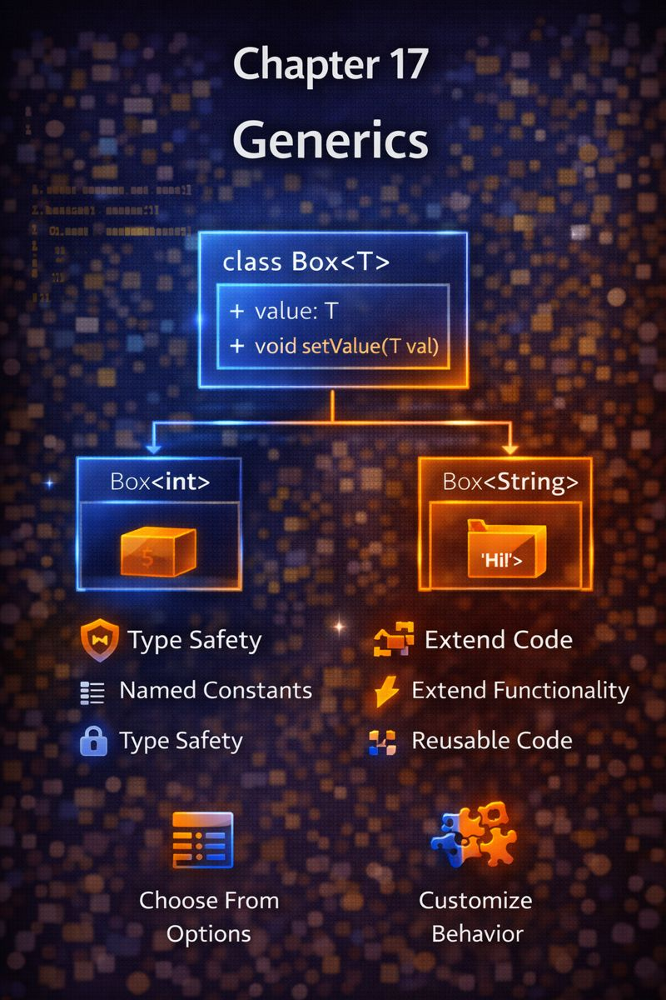

# Chapter 17: Generics



## 1. Concept Goal  
**What problem does this solve?**  
Without generics, you’d need separate classes for `StringList`, `UserList`, `ProductList`—or resort to unsafe `dynamic` types that cause runtime errors.  
Generics let you **write reusable code that works with any type—while keeping full type safety**.

---

## 2. Logical Explanation  
Generics mean:  
> “Write logic once, and let the compiler **specialize it** for each type you use.”

Think of a `List<T>`:  
- `T` is a placeholder for *any* type  
- When you write `List<String>`, `T` becomes `String`  
- The compiler ensures you only add strings—and gets strings back

Benefits:  
✅ **Type safety**: catch errors at compile time  
✅ **Reusability**: one class works for many types  
✅ **No casting**: no need for `as String` or `dynamic`

> Generics = **flexibility without sacrificing safety**.

---

## 3. Visual Representation  

```
        Box<T> (Generic Template)
        ┌───────────────────────┐
        │ T content             │
        │                       │
        │ void set(T value)     │
        │ T get()               │
        └───────────▲───────────┘
                    │
        ┌───────────┴───────────┐
        │                       │
Box<String>               Box<int>
┌─────────────────┐   ┌─────────────────┐
│ content: "Hi"   │   │ content: 42     │
│ get() → String  │   │ get() → int     │
└─────────────────┘   └─────────────────┘
```

> Same blueprint, different types—enforced by the compiler.

---

## 4. Dart Syntax  

```dart
// Generic class
class Box<T> {
  T? _value;

  void set(T value) => _value = value;
  T? get() => _value;
}

// Generic function
T? first<T>(List<T> items) {
  return items.isEmpty ? null : items[0];
}

// Usage
final stringBox = Box<String>();
stringBox.set('Hello');
// stringBox.set(123); // ❌ Compile error

final names = ['Ali', 'Sara'];
final first = first(names); // inferred as String?
```

> - `<T>` is the type parameter (convention: `T`, `E`, `K`, `V`)  
> - Dart infers types when possible—no need to write `<String>` everywhere

---

## 5. Practical Examples  

### Example 1: API Response Wrapper  
```dart
class ApiResponse<T> {
  final T? data;
  final String? error;

  ApiResponse.success(this.data) : error = null;
  ApiResponse.error(this.error) : data = null;

  bool get isSuccess => data != null;
}

// Usage
final userResponse = ApiResponse<User>.success(user);
final errorResponse = ApiResponse<String>.error('Not found');
```

### Example 2: State Management (Conceptual)  
```dart
class ValueNotifier<T> {
  T _value;
  T get value => _value;
  set value(T newValue) {
    _value = newValue;
    notifyListeners();
  }
  // ...
}

final counter = ValueNotifier<int>(0);
final isLoggedIn = ValueNotifier<bool>(false);
```

> Same logic, different types—zero duplication.

---

## 6. Problem-Solving Exercises  

**Easy**  
1. Write a generic function `swap<T>(List<T> list, int i, int j)` that swaps two elements.

**Medium**  
2. Create a generic `Cache<T>` class that stores one value of type `T`.  
   It should have `set(T value)` and `T? get()`.

**Advanced**  
3. Design a `Result<T>` type (like in Rust/Swift) that holds **either** a success value (`T`) **or** an error (`String`).  
   It should have methods `isSuccess`, `getValue()`, and `getError()`.

---

## 7. Clean Solution & Explanation  

**Exercise 1**  
```dart
void swap<T>(List<T> list, int i, int j) {
  final temp = list[i];
  list[i] = list[j];
  list[j] = temp;
}
```
> Works for `List<int>`, `List<String>`, etc.—same code, full type safety.

**Exercise 2**  
```dart
class Cache<T> {
  T? _value;

  void set(T value) => _value = value;
  T? get() => _value;
}
```
> Reusable cache for any type—no casting needed.

**Exercise 3**  
```dart
class Result<T> {
  final T? _value;
  final String? _error;

  Result.success(T value) : _value = value, _error = null;
  Result.error(String error) : _error = error, _value = null;

  bool get isSuccess => _value != null;
  T getValue() => _value!;
  String getError() => _error!;
}
```
> Forces caller to **handle both success and error cases** explicitly.  
> Used heavily in robust Dart/Flutter apps.

---

## 8. Key Takeaways  
- Generics enable **type-safe reuse**  
- Use `<T>` in classes, functions, and methods  
- Dart infers types—write less, get more safety  
- Common in collections (`List<T>`), state management, and API wrappers  
- Avoid `dynamic`—use generics instead for flexibility **with** safety
