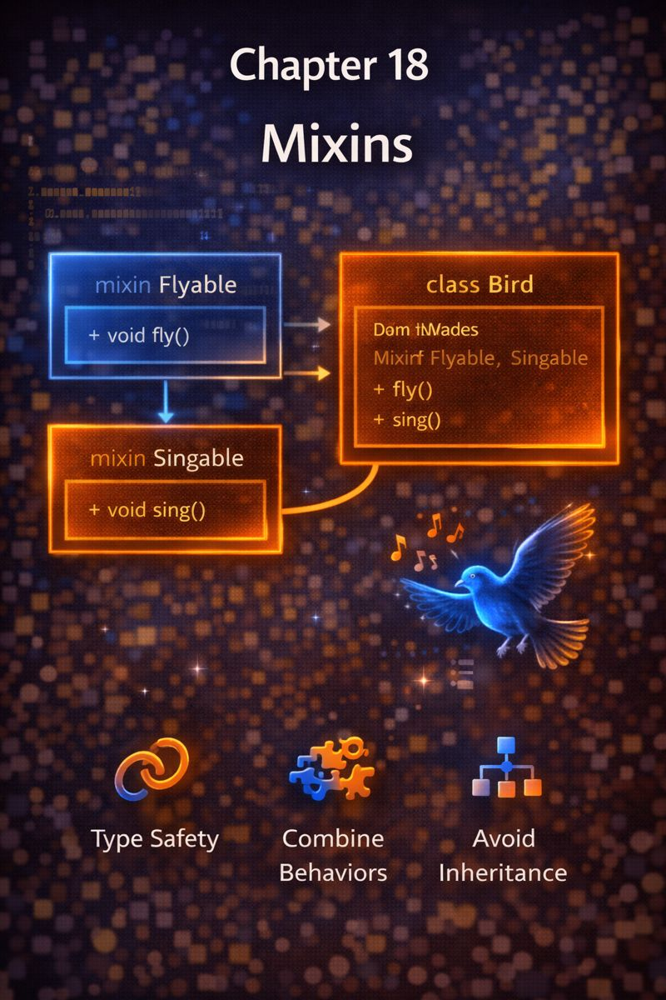

# Chapter 18: Mixins



## 1. Concept Goal  
**What problem does this solve?**  
Inheritance only allows one parent (`class A extends B`), but sometimes an object needs **multiple reusable behaviors** from unrelated sources (e.g., a `Car` that can `log()` and `serialize()`).  
Mixins let you **add functionality from multiple sources** without deep inheritance trees.

---

## 2. Logical Explanation  
A **mixin** is a reusable chunk of behavior you can **“mix into”** any class.  
Unlike inheritance (which models “is-a”), mixins model **“can-do”** capabilities.

Key rules:  
- A class can use **multiple mixins**  
- Mixins **cannot be instantiated alone**  
- Mixins **cannot have constructors with parameters** (in Dart)

Why use mixins?  
✅ Share code across unrelated classes  
✅ Avoid diamond problem of multiple inheritance  
✅ Keep classes focused (separation of concerns)

> Mixins = **plug-in behaviors** that any class can adopt.

---

## 3. Visual Representation  

```
        Car
        ┌───────────────┐
        │ - brand       │
        │ - speed       │
        └───────▲───────┘
                │
    ┌───────────┴───────────┐
    │                       │
LoggableMixin        SerializableMixin
┌───────────────┐   ┌─────────────────────┐
│ void log()    │   │ String toJson()     │
└───────────────┘   └─────────────────────┘
```

> `Car` gains logging and serialization—without inheriting from either.

---

## 4. Dart Syntax  

```dart
// Define mixins
mixin Loggable {
  void log(String message) {
    print('[LOG] $message');
  }
}

mixin Serializable {
  Map<String, dynamic> toJson();
}

// Use multiple mixins
class Car with Loggable, Serializable {
  String brand;
  int speed;

  Car(this.brand, this.speed);

  @override
  Map<String, dynamic> toJson() {
    return {'brand': brand, 'speed': speed};
  }
}

// Usage
final car = Car('Tesla', 120);
car.log('Car created');        // from Loggable
print(car.toJson());           // from Serializable
```

> - Use `mixin` to define  
> - Use `with` to apply  
> - Overrides (like `toJson`) must be implemented if required

---

## 5. Practical Examples  

### Example 1: Flutter State Management  
```dart
mixin Observable {
  List<VoidCallback> _listeners = [];
  void addListener(VoidCallback listener) => _listeners.add(listener);
  void notifyListeners() => _listeners.forEach((f) => f());
}

class Counter with Observable {
  int _count = 0;
  int get count => _count;

  void increment() {
    _count++;
    notifyListeners(); // from mixin
  }
}
```

> Reusable change notification—used in `ChangeNotifier`.

### Example 2: Validation Mixin  
```dart
mixin Validatable {
  bool get isValid;
  String? get validationMessage;
}

class EmailField with Validatable {
  final String value;
  EmailField(this.value);

  @override
  bool get isValid => value.contains('@');

  @override
  String? get validationMessage => isValid ? null : 'Invalid email';
}
```

> Any field can become validatable by mixing in `Validatable`.

---

## 6. Problem-Solving Exercises  

**Easy**  
1. Create a `Timestamped` mixin that adds a `createdAt` field set to `DateTime.now()` when the object is created.

**Medium**  
2. A `User` and a `Product` both need to be `Clonable` (have a `copy()` method).  
   Define a mixin and apply it to both.

**Advanced**  
3. In Flutter, you want widgets that automatically log when built.  
   Create a `BuildLogger` mixin that prints the class name on `build()`.  
   (Assume a base `StatelessWidget` subclass.)

---

## 7. Clean Solution & Explanation  

**Exercise 1**  
```dart
mixin Timestamped {
  DateTime createdAt = DateTime.now();
}
```

> Applied with: `class Event with Timestamped { ... }`

**Exercise 2**  
```dart
mixin Clonable<T> {
  T copy();
}

class User with Clonable<User> {
  final String name;
  User(this.name);
  @override
  User copy() => User(name);
}

class Product with Clonable<Product> {
  final String title;
  Product(this.title);
  @override
  Product copy() => Product(title);
}
```
> Generic mixin ensures `copy()` returns correct type.

**Exercise 3**  
```dart
mixin BuildLogger<T extends StatelessWidget> on T {
  void logBuild() {
    print('Building ${runtimeType}');
  }
}

class MyWidget extends StatelessWidget with BuildLogger {
  @override
  Widget build(BuildContext context) {
    logBuild(); // prints "Building MyWidget"
    return Container();
  }
}
```
> `on T` restricts mixin to `StatelessWidget` subclasses.  
> Used in debugging or analytics.

---

## 8. Key Takeaways  
- Mixins add **reusable behaviors** to any class  
- Use `mixin` to define, `with` to apply  
- A class can use **multiple mixins**  
- Mixins enable **horizontal code reuse** (vs inheritance’s vertical)  
- Flutter uses mixins heavily (e.g., `WidgetsBindingObserver`, `ChangeNotifier`)
