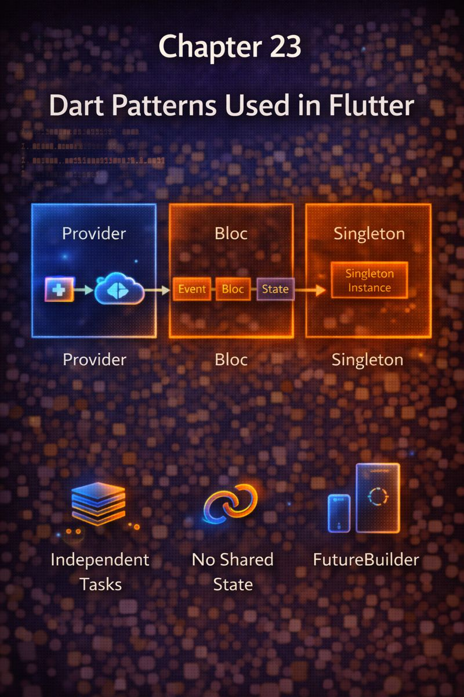

# Chapter 23: Dart Patterns Used in Flutter



## 1. Concept Goal  
**What problem does this solve?**  
Flutter’s API is built on specific Dart patterns. Without understanding them, you’ll misconfigure widgets, misuse callbacks, or write inefficient state logic.  
This chapter reveals the **core Dart patterns that power Flutter**—so you write idiomatic, performant code from day one.

---

## 2. Logical Explanation  
Flutter isn’t just a UI toolkit—it’s a **Dart-first framework**. Its design leans heavily on:  
- **Named parameters** for clear, optional configuration  
- **Callbacks** (`VoidCallback`, `ValueChanged<T>`) for event handling  
- **Immutable widget trees** rebuilt on state change  
- **Factories and builders** to delay object creation  

These aren’t arbitrary—they solve real problems:  
✅ **Readability**: `ElevatedButton(onPressed: ..., child: ...)` > positional chaos  
✅ **Efficiency**: Build only what’s needed, when it’s needed  
✅ **Safety**: Immutability prevents accidental side effects in the widget tree

> Flutter’s Dart patterns exist to make UI code **declarative, safe, and scalable**.

---

## 3. Visual Representation  

**Widget as Configuration Object**  
```
ElevatedButton
├── onPressed: () → void          ← Callback
├── style: ButtonStyle?           ← Optional (named param)
└── child: Widget                 ← Required (immutable subtree)
```

**Callback Flow**  
```
User taps → Widget calls onPressed() → State updates → Rebuild
```

> Widgets are **instructions**, not live views. Flutter interprets them.

---

## 4. Dart Syntax  

```dart
// 1. Named parameters (required vs optional)
ElevatedButton({
  required VoidCallback onPressed, // must be provided
  ButtonStyle? style,              // optional
  required Widget child,           // required
});

// 2. Callbacks
class MyWidget extends StatelessWidget {
  final void Function()? onTap; // same as VoidCallback?
  const MyWidget({this.onTap, super.key});

  @override
  Widget build(BuildContext context) {
    return GestureDetector(
      onTap: onTap, // pass through
      child: Text('Click me'),
    );
  }
}

// 3. Builder pattern (delayed creation)
ListView.builder(
  itemCount: 100,
  itemBuilder: (context, index) {
    // Build ONLY visible items
    return ListTile(title: Text('Item $index'));
  },
);
```

> - `required` enforces essential config  
> - `?` marks optional callbacks  
> - Builders avoid creating 1000 widgets at once

---

## 5. Practical Examples  

### Example 1: Custom Widget with Callback  
```dart
class ConfirmDialog extends StatelessWidget {
  final VoidCallback onConfirm;
  final VoidCallback onCancel;

  const ConfirmDialog({
    required this.onConfirm,
    required this.onCancel,
    super.key,
  });

  @override
  Widget build(BuildContext context) {
    return AlertDialog(
      content: Text('Are you sure?'),
      actions: [
        TextButton(onPressed: onCancel, child: Text('No')),
        TextButton(onPressed: onConfirm, child: Text('Yes')),
      ],
    );
  }
}

// Usage
showDialog(
  context: context,
  builder: (_) => ConfirmDialog(
    onConfirm: () => deleteItem(),
    onCancel: () => Navigator.pop(context),
  ),
);
```

### Example 2: Efficient List with Builder  
```dart
// Instead of: List.generate(1000, ...) → builds all at once
ListView.builder(
  itemCount: products.length,
  itemBuilder: (context, i) => ProductTile(product: products[i]),
);
```

> Only builds widgets currently on screen.

---

## 6. Problem-Solving Exercises  

**Easy**  
1. Why is `child` in `Container({Widget? child})` optional, but `itemBuilder` in `ListView.builder` required?

**Medium**  
2. You’re building a `SettingsTile` widget that shows a label and an optional icon.  
   Write its constructor using named parameters.

**Advanced**  
3. A `FutureBuilder` rebuilds its `builder` every time the widget rebuilds—even if the `Future` hasn’t changed.  
   How do you prevent unnecessary work? (Hint: Think about where you create the `Future`.)

---

## 7. Clean Solution & Explanation  

**Exercise 1**  
> - `Container` may be used just for styling (no child needed)  
> - `ListView.builder` **must** know how to build items—no default possible

**Exercise 2**  
```dart
class SettingsTile extends StatelessWidget {
  final String label;
  final Widget? icon; // optional

  const SettingsTile({
    required this.label,
    this.icon,
    super.key,
  });

  @override
  Widget build(BuildContext context) {
    return Row(
      children: [
        if (icon != null) icon!,
        Text(label),
      ],
    );
  }
}
```
> Optional icon via `Widget?` and conditional rendering.

**Exercise 3**  
> **Never create the `Future` inside `build`**:  
```dart
// ❌ BAD: New Future on every rebuild
builder: (context) => FutureBuilder(
  future: fetchData(), // ← recreated constantly
  ...
)

// ✅ GOOD: Create once in state
class MyWidget extends StatefulWidget {
  @override
  State<MyWidget> createState() => _MyWidgetState();
}

class _MyWidgetState extends State<MyWidget> {
  late final Future<Data> _future = fetchData(); // once!

  @override
  Widget build(BuildContext context) {
    return FutureBuilder(future: _future, ...);
  }
}
```
> Ensures the same `Future` instance is used—no redundant calls.

---

## 8. Key Takeaways  
- Flutter uses **named parameters** for clarity and optionality  
- **Callbacks** (`onPressed`, `onChanged`) drive interactivity  
- **Builders** (`itemBuilder`, `builder`) enable lazy, efficient UI  
- **Immutability** ensures widget trees are safe to rebuild  
- Always create `Future`/`Stream` **outside** `build` to avoid side effects
