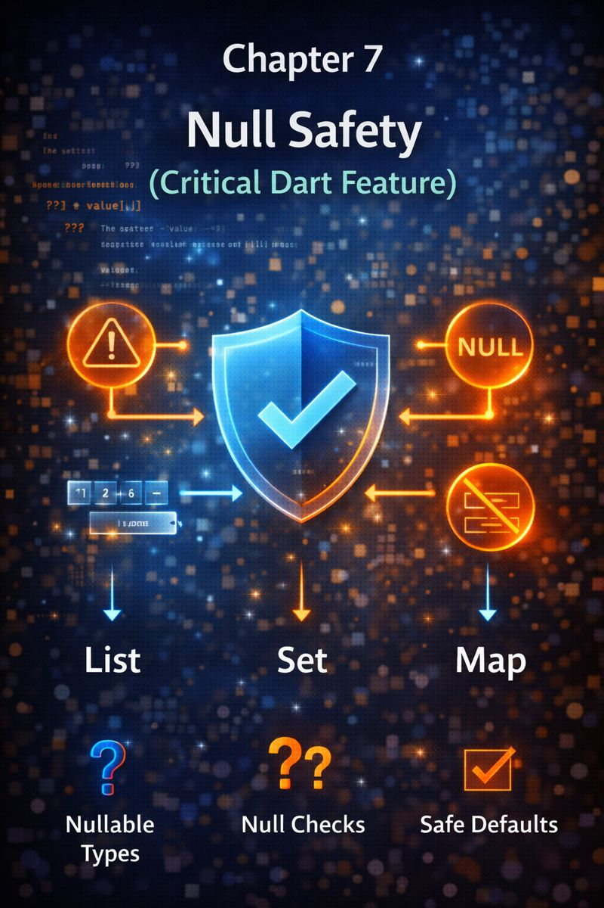

# Chapter 7: Null Safety (Critical Dart Feature)



## 1. Concept Goal

**What problem does this solve?**\
In many languages, using a missing value (`null`) causes crashes like “Cannot read property of null.”\
Dart’s null safety **eliminates these runtime errors at compile time** by making nullability explicit and enforced.

***

## 2. Logical Explanation

Before null safety, any variable could secretly be `null`—leading to unpredictable crashes.\
Dart flips this: **every value is non-nullable by default**. If something _can_ be missing, you **must say so**.

* **Non-nullable**: `String name` → will _always_ have a value.
* **Nullable**: `String? email` → might be a string, or `null`.

This forces you to **handle missing data consciously**, not by accident.\
It’s like wearing a seatbelt: a small upfront effort that prevents disaster.

Key mindset:

> “If it can be absent, mark it `?`. If you use it, prove it’s not `null`.”

***

## 3. Visual Representation

```
Non-nullable (String)       Nullable (String?)
┌──────────────────┐       ┌──────────────────┐
│ Value required!  │       │ Value OR null    │
│ "Ali"    ✅      │       │ "ali@mail.com" ✅│
│ null     ❌      │       │ null        ✅   │
└──────────────────┘       └──────────────────┘
       Compile error                Allowed
```

**Null-aware operators flow**:

```
value ?? 'default'   → Use value, or fallback if null
obj?.method()        → Call method only if obj isn’t null
obj!.method()        → “I swear it’s not null!” (use sparingly)
```

> Safety comes from **explicit choices**, not assumptions.

***

## 4. Dart Syntax

```dart
// Non-nullable (must be initialized)
String name = 'Ali';

// Nullable
String? email;

// Null-aware operators
String displayName = email ?? 'Guest'; // fallback

// Safe call
int? length = email?.length; // null if email is null

// Force unwrap (avoid unless absolutely sure)
int dangerous = email!.length; // CRASH if email is null

// Late keyword (use carefully)
late String config; // promise to initialize before use
```

> Prefer `??` and `?.` over `!`. The compiler is your ally—don’t bypass it.

***

## 5. Practical Examples

### Example 1: Safe User Display

```dart
String getDisplayName(User user) {
  return user.firstName ?? user.lastName ?? 'Anonymous';
}
```

### Example 2: Optional Callback in Flutter

```dart
class MyWidget extends StatelessWidget {
  final VoidCallback? onRetry; // optional callback

  @override
  Widget build(BuildContext context) {
    return ElevatedButton(
      onPressed: onRetry ?? null, // button disabled if null
      child: Text('Retry'),
    );
  }
}
```

> Null safety makes optional features **explicit and safe**.

***

## 6. Problem-Solving Exercises

**Easy**

1. Declare a variable that _might_ hold a phone number. What type do you use?

**Medium**\
2\. You have `String? middleName`.\
Write an expression that returns `middleName` if it exists, or an empty string.

**Advanced**\
3\. A function returns `User?`.\
Safely access `user.address.city` without crashing if any part is `null`.

***

## 7. Clean Solution & Explanation

**Exercise 1**

```dart
String? phoneNumber;
```

> `?` signals it’s optional. Caller must check before use.

**Exercise 2**

```dart
String result = middleName ?? '';
```

> Clean, readable, and crash-proof.

**Exercise 3**

```dart
String? city = user?.address?.city;
// Or with fallback:
String cityName = user?.address?.city ?? 'Unknown';
```

> Chained `?.` stops at first `null`—no crash.\
> This is called **null-aware chaining**.

> ⚠️ Never write `user!.address!.city!` unless you’ve already validated the whole chain.

***

## 8. Key Takeaways

* **Non-nullable by default**: `Type` means “never null.”
* **Nullable**: `Type?` means “might be null—handle it.”
* Use `??` for fallbacks, `?.` for safe access.
* Avoid `!`—it defeats null safety.
* Null safety isn’t bureaucracy—it’s **compile-time bug prevention**.
