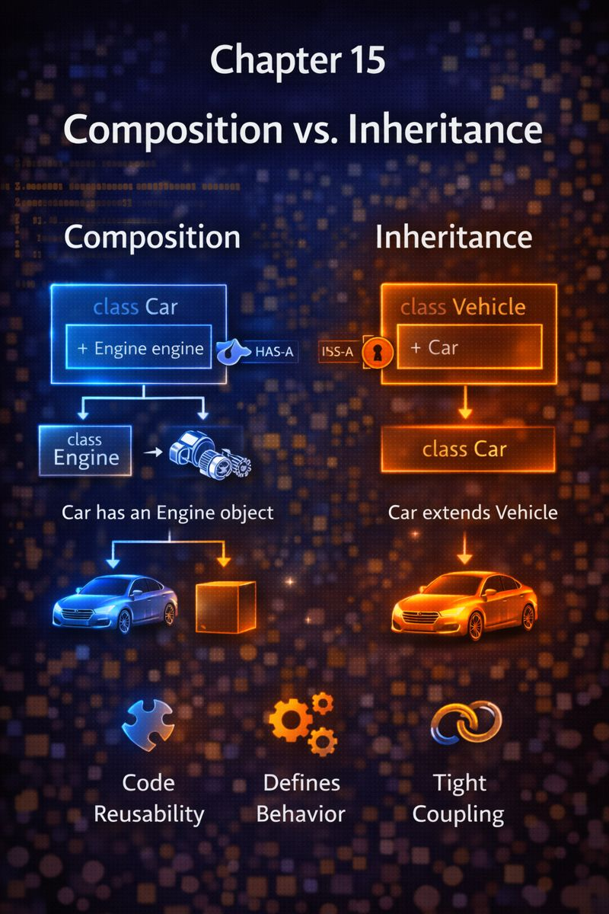

# Chapter 15: Composition vs Inheritance



## 1. Concept Goal

**What problem does this solve?**\
Inheritance can lead to rigid, fragile hierarchies when misused (e.g., “a `Car` is a `Vehicle`” ✅, but “a `Car` is an `Engine`” ❌).\
Composition offers a **more flexible, maintainable way to build objects** by assembling them from smaller, focused parts.

***

## 2. Logical Explanation

Two ways to reuse code:

* **Inheritance**: “Is-a” relationship (`Dog` **is a** `Animal`)
* **Composition**: “Has-a” relationship (`Car` **has an** `Engine`)

The golden rule:

> **Favor composition over inheritance.**

Why?\
✅ Composition is **more flexible**: swap parts at runtime\
✅ Avoids **deep, brittle hierarchies**\
✅ Promotes **single-responsibility** objects\
✅ Easier to test (mock individual components)

Inheritance should model **true specialization**.\
Composition models **collaboration between independent pieces**.

***

## 3. Visual Representation

**Inheritance (Rigid)**

```
Vehicle → Car → ElectricCar → TeslaModel3
```

> Changing `Vehicle` breaks everything below.

**Composition (Flexible)**

```
Car
├── Engine (GasEngine or ElectricMotor)
├── Steering (Manual or PowerSteering)
└── MediaSystem (Basic or Premium)
```

> Mix and match parts. Change one without affecting others.

> Composition = **building with LEGO bricks**\
> Inheritance = **carving from a single block of wood**

***

## 4. Dart Syntax

```dart
// ❌ Questionable inheritance
class Car extends Engine { // A car IS an engine? No!
  // ...
}

// ✅ Clean composition
class Car {
  final Engine engine;
  final Steering steering;

  Car({required this.engine, required this.steering});

  void start() {
    engine.ignite();
  }
}

class ElectricMotor implements Engine {
  @override
  void ignite() => print('Motor spinning silently');
}

class GasEngine implements Engine {
  @override
  void ignite() => print('Engine roaring to life');
}
```

> `Car` **has** an `Engine`—not **is** an `Engine`.

***

## 5. Practical Examples

### Example 1: Flutter Widget Composition

```dart
// Instead of deep inheritance:
// class PrimaryButton extends Button extends StatelessWidget...

// Use composition:
ElevatedButton(
  style: ElevatedButton.styleFrom(backgroundColor: Colors.blue),
  child: Text('Submit'),
  onPressed: () {},
)
```

> Flutter itself favors composition: widgets are **assembled**, not inherited.

### Example 2: User with Roles

```dart
class User {
  final String name;
  final PermissionSet permissions; // composed role

  bool canEdit() => permissions.canEdit;
}

class AdminPermissions implements PermissionSet {
  @override
  bool get canEdit => true;
}

class ViewerPermissions implements PermissionSet {
  @override
  bool get canEdit => false;
}
```

> User **has** permissions—not **is** an admin.

***

## 6. Problem-Solving Exercises

**Easy**

1. A `Smartphone` has a `Camera`, a `Battery`, and a `Screen`.\
   Model this using composition (not inheritance).

**Medium**\
2\. You have `Bird` and `Airplane`, both can `fly()`.\
Should they inherit from a `Flyable` base class? Why or why not?\
Propose a composition-based alternative.

**Advanced**\
3\. In a game, a `Character` can:

* Move (walk, run, teleport)
* Attack (sword, magic, ranged)
* Defend (shield, dodge, block)\
  Design using composition so behaviors can be mixed freely.

***

## 7. Clean Solution & Explanation

**Exercise 1**

```dart
class Smartphone {
  final Camera camera;
  final Battery battery;
  final Screen screen;

  Smartphone({
    required this.camera,
    required this.battery,
    required this.screen,
  });
}
```

> Each part can be tested and replaced independently.

**Exercise 2**

> **No**—`Bird` and `Airplane` are unrelated concepts that coincidentally share a behavior.\
> Inheriting from `Flyable` creates a false “is-a” relationship.

**Composition alternative**:

```dart
class Bird {
  final FlightBehavior flight = FlapWings();
  void fly() => flight.execute();
}

class Airplane {
  final FlightBehavior flight = JetPropulsion();
  void fly() => flight.execute();
}
```

> Shared behavior via **delegation**, not inheritance.

**Exercise 3**

```dart
class Character {
  final Movement movement;
  final Attack attack;
  final Defense defense;

  Character({
    required this.movement,
    required this.attack,
    required this.defense,
  });

  void move() => movement.execute();
  void fight() => attack.execute();
  void protect() => defense.execute();
}

// Mix and match:
final hero = Character(
  movement: Teleport(),
  attack: MagicSpell(),
  defense: ShieldBlock(),
);
```

> Endless combinations without inheritance explosions.

***

## 8. Key Takeaways

* **Inheritance**: Use only for true “is-a” relationships
* **Composition**: Use for “has-a” or “uses-a” relationships
* **Favor composition**: it’s more flexible, testable, and scalable
* Flutter itself is built on composition—follow its lead
* When in doubt, ask: “Is this **part of** the object, or **something it has**?”
